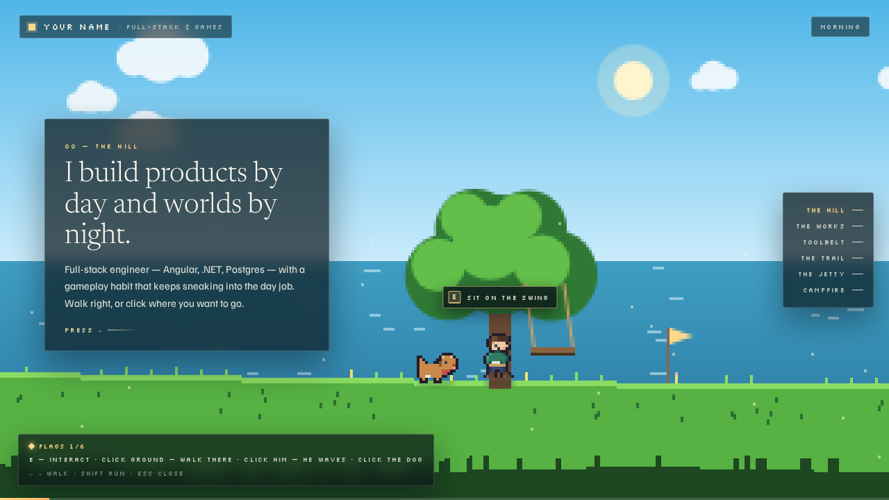
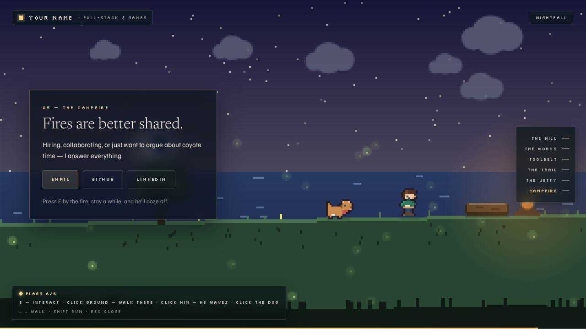
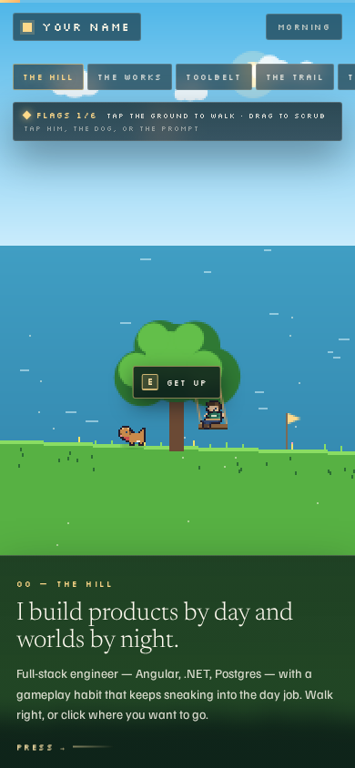

# Pixel World — Developer Portfolio

A side-scrolling pixel-art portfolio built with Angular 21. You walk an avatar east across a
3260-pixel world; the walk position drives everything — which content panel opens, the time of day,
the progress bar, the HUD. Dawn on the hill, nightfall at the campfire.

Live at **<https://nk-0-0.github.io/portfolio/>**

| Dawn on the hill | Nightfall at the campfire | Portrait |
|---|---|---|
|  |  |  |

---

## How it works

A single `<canvas>` renders the world. A DOM overlay renders the content on top of it. The two talk
through exactly one place — a service full of signals.

| Layer | File | Responsibility |
|---|---|---|
| Routes | `src/app/app.routes.ts` | `/` the world (eager), `/read` the document (lazy). |
| Engine | `src/app/world/world-renderer.ts` | Simulation and painting. Plain TypeScript, no Angular. |
| Bridge | `src/app/world/world-state.service.ts` | Signals out (state), commands in. |
| Overlay | `src/app/ui/**` | Panels, HUD, project overlay. Read signals only. |
| Content | `src/app/content/portfolio.content.ts` | Every word and link on the site. |

The art is not image files. Sprites are arrays of equal-length strings in
`src/app/world/sprites.ts`, where each character indexes a colour palette and `.` is transparent:

```ts
walkA: [
  '................','.....kkkkk......','....knnhhhhk....',
  '...khnnhhhhk....','...khfssssk.....', /* ... */
],
```

Change a character, change the world. Everything draws 1:1 into a small offscreen buffer that is
blitted up with smoothing off, so the pixels stay crisp and a 4K display costs no more to render
than a 1080p one.

## Controls

| Input | Action |
|---|---|
| `←` `→` or `A` `D` | Walk |
| `Shift` | Run |
| `E` | Interact at the current stop |
| Click / tap the ground | Walk there |
| Click / tap the avatar or the dog | They react |
| Tap the prompt bubble | Interact — the touch stand-in for `E` |
| Wheel, trackpad, or drag | Scrub along the world |
| Chapter nav | Fast-travel, capped at ~4.5s for any trip |
| `Esc` | Close a case study |

On phones the world re-frames for portrait, panels dock as bottom sheets, and the chapter nav
becomes a horizontal strip.

**Would rather not walk?** [`/#/read`](https://nk-0-0.github.io/portfolio/#/read) is the whole
portfolio as one plain document — the same content, rendered from the same source file. It is also
the print/PDF surface.

## Getting started

```bash
npm install
npm start          # http://localhost:4200
```

## Making it yours

Almost everything you'll want to change lives in **`src/app/content/portfolio.content.ts`** — your
name, the panel copy, the skill tiles, the timeline, the projects and their case studies, the
contact links. Nothing under `ui/` hardcodes copy.

Values currently marked `TODO` in that file are placeholders inherited from the design prototype
(`YOUR NAME`, `Company Name`, `you@example.com`) and still need real details.

Project screenshots go in `public/projects/` and are referenced by `detail.image`; a project with
`image: null` renders an empty frame with a prompt instead.

Colour and typography tokens are CSS custom properties at the top of `src/styles.scss`. The world's
own palettes (day, dusk, night) are in `src/app/world/palette.ts`.

## Scripts

```bash
npm start                # dev server
npm run build            # production build
npm run typecheck        # tsc --noEmit
npm run lint             # angular-eslint
npx ng test --no-watch   # Vitest unit tests
npm run e2e:local        # Playwright against a locally built production bundle
npm run perf:fps         # frame-timing regression gate (p95, 15% tolerance)
```

## Quality gates

CI runs lint, typecheck, unit tests and a production build on every PR. Playwright runs the smoke
suite across Chromium, Firefox and WebKit. Lighthouse CI asserts accessibility ≥ 0.95 and
best-practices ≥ 0.95 as hard errors.

Current production bundle: **300 kB raw / 81 kB transferred**, with the document view code-split out. Lighthouse: 100 accessibility, 100 best
practices, 100 SEO, 99 performance.

## Origin

Ported from a Claude design-canvas prototype, preserved unbuilt at `claude design/` in the repo
root. The prototype's renderer was framework-agnostic canvas code and was lifted nearly verbatim;
its presentation layer — inline styles on every element, a bespoke `style-hover` attribute, and a
render loop that mutated panels through `document.querySelectorAll` sixty times a second — was
rewritten as Angular components. See [`CLAUDE.md`](CLAUDE.md) for the architecture rules that came
out of that.

## Attribution

The pixel art is original. Fonts are SIL OFL (Silkscreen, Newsreader, Familjen Grotesk); technology
icons are MIT-licensed Devicon, hot-linked from jsDelivr with text fallbacks. Full ledger in
[`docs/ASSET_CREDITS.md`](docs/ASSET_CREDITS.md).
